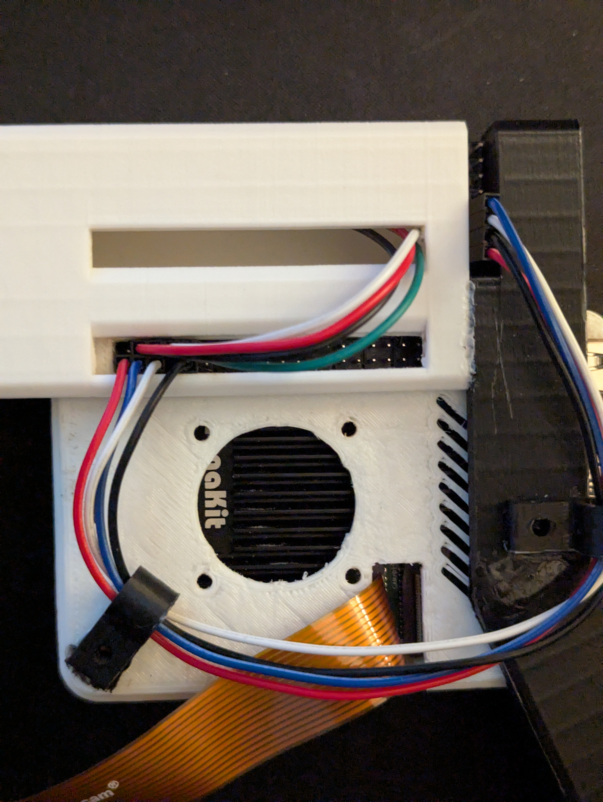
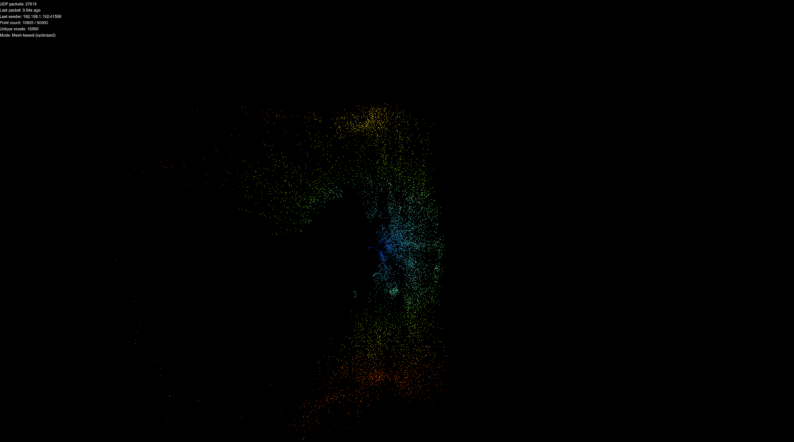
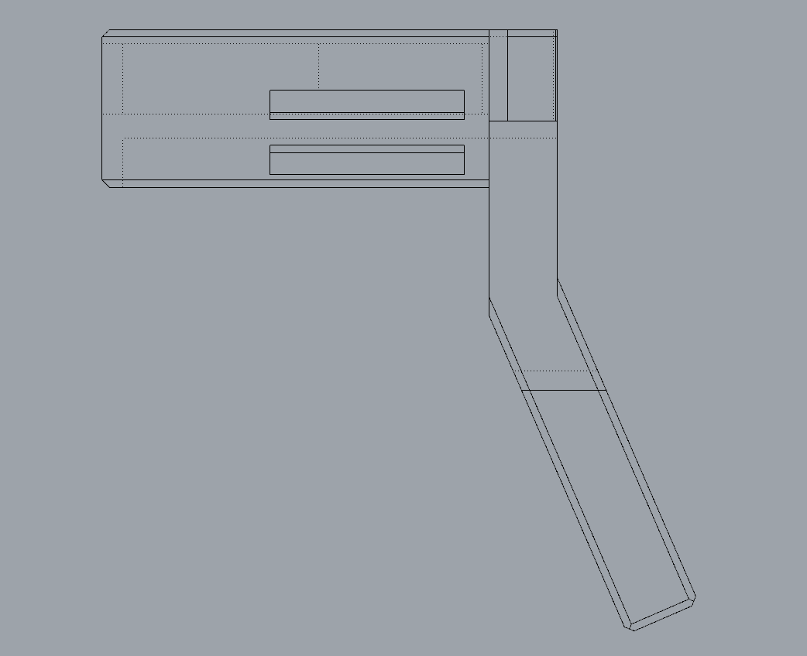
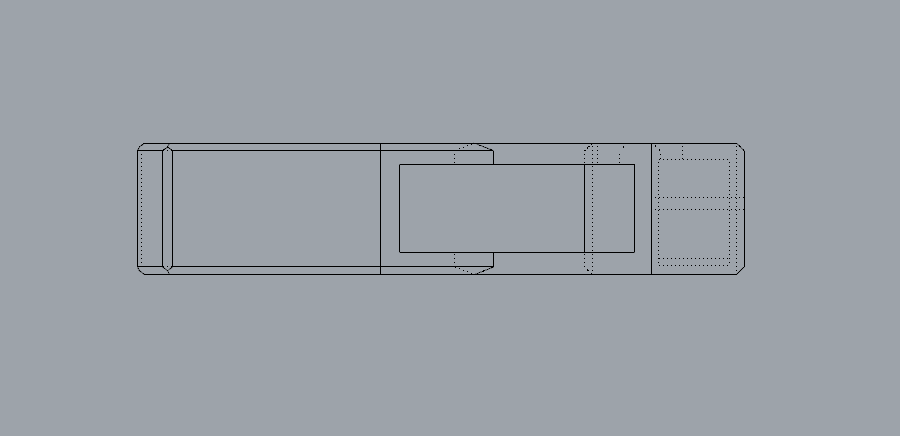

<!-- _class: lead -->
# Handheld LiDAR Scanner System
## Custom Sensor Build to Point Cloud Visualization

 
Logan Cooper  
SUNY New Paltz

<div class="callout">
This project combines hardware integration, Python tooling, networking, CAD and 3D printing, and VR rendering into one working spatial scanning pipeline.
</div>

---

# Why This Project Matters

<div class="columns">
<div class="panel">
<div class="label">Core Idea</div>
Build a low-cost handheld system that turns real-world distance samples into a 3D point cloud.

</div>
<div class="panel">
<div class="label">What It Shows</div>
Physical hardware, embedded-style integration, data processing, visualization, and immersive interaction.
</div>
</div>

<div class="metric-row">
<div class="metric"><strong>Hardware</strong> TF-Luna, BNO055, Pi 5, Pi Camera 3, 3D printed housing</div>
<div class="metric"><strong>Software</strong> Python tools, HAL interfaces, Unity and Godot visualization</div>
<div class="metric"><strong>Outcome</strong> Live UDP stream into a 2D and VR point cloud viewer</div>
</div>

---

# What Is LiDAR?

**LiDAR** stands for **Light Detection and Ranging**.

It works by sending out laser pulses and measuring how long they take to return, which gives distance information that can be used to reconstruct the surrounding environment.

<div class="columns">
<div class="panel">
<strong>Common Uses</strong>
<ul>
  <li>Autonomous navigation</li>
  <li>Robotics and mapping</li>
  <li>Surveying and architecture</li>
  <li>AR and VR spatial computing</li>
</ul>
</div>
<div class="panel">
<strong>Why It Fits This Project</strong>
<ul>
  <li>Strong mix of hardware and software</li>
  <li>Clear real-world application</li>
  <li>Good match for CAD and fabrication work</li>
  <li>Expandable toward mobile scanning and SLAM</li>
</ul>
</div>
</div>

---

# Project Story

> The project began as a custom LiDAR scanner concept and evolved into a working end-to-end system that reads sensors on a Raspberry Pi, transforms the data into 3D points, and visualizes the results inside a Unity/Godot environment and soon into a Quest 3 VR application.


---

<!-- _class: section -->
# Build Components
## Hardware and software pieces that make the system work

---

# System Components and Their Roles

| Component | What it does in the project |
|---|---|
| TF-Luna LiDAR | Captures 1D distance samples from the environment |
| BNO055 IMU | Provides quaternion orientation for 3D point transformation |
| Raspberry Pi 5 | Runs the Python code, sensor acquisition, and UDP transmission |
| Pi Camera 3 | Supported calibration and ArUco marker localization experiments |
| 3D printed housing | Turns the electronics into a handheld scanner form factor |
| Unity / Godot | Receives and visualizes live spatial data |
| Meta Quest 3 | Will make the point cloud explorable in immersive VR |

---

# Software Stack

<div class="columns">
<div class="panel">
<strong>Python Side</strong>
<ul>
  <li>Sensor readers for TF-Luna and BNO055</li>
  <li>Test utilities and data output tools</li>
  <li>UDP sender scripts</li>
  <li>HAL interfaces for cleaner integration and mocking</li>
</ul>
</div>
<div class="panel">
<strong>Visualization Side</strong>
<ul>
  <li>Unity for earlier visualization and marker testing</li>
  <li>Godot 4 project for current VR rendering</li>
  <li>Custom point cloud shader and material pipeline</li>
  <li>Quest 3 deployment and debugging workflow</li>
</ul>
</div>
</div>

<div class="callout">
This split was important: the Pi handles sensing and transformation, while the engine handles rendering and user experience.
</div>

---

# Unity Progress (Completed)

<div class="columns">
<div class="panel">
<strong>What I Finished in Unity</strong>
<ul>
  <li>Built UDP data bridge from Raspberry Pi to Unity</li>
  <li>Validated TF-Luna and BNO055 data flow in real time</li>
  <li>Implemented ArUco marker pose streaming into Unity</li>
  <li>Updated receiver to handle both sensor and marker data</li>
</ul>
</div>
<div class="panel">
<strong>Why This Matters</strong>
<ul>
  <li>Proved core scanner pipeline works end-to-end</li>
  <li>Confirmed packet format and transform logic</li>
  <li>Reduced risk before moving to VR deployment</li>
</ul>
</div>
</div>

---

<!-- _class: section -->
# Main Challenge
## Pi Camera 3 integration issues and project pivot

---

# Pi Camera 3 Challenge and Pivot to VR

<div class="columns">
<div class="panel">
<strong>Problem I Ran Into</strong>
<ul>
  <li>Pi Camera 3 setup was inconsistent across packages/drivers</li>
  <li>Marker pipeline added complexity during live integration</li>
  <li>Troubleshooting consumed time better spent on core scanning workflow</li>
</ul>
</div>
<div class="panel">
<strong>Decision and Result</strong>
<ul>
  <li>Kept Unity progress as validated foundation</li>
  <li>Shifted visualization path to Quest 3 VR pipeline</li>
  <li>Simplified interactive inspection of point clouds</li>
</ul>
</div>
</div>

<div class="callout">
The switch to VR was a strategic project decision, not a reset: it built on the data pipeline already proven in Unity.
</div>

---

<!-- _class: section -->
# Construction
## Wiring, CAD, printing, and assembly

---

# How the Scanner Was Built

<div class="columns">
<div>

1. Wire the TF-Luna to the Raspberry Pi over UART.
2. Wire the BNO055 IMU to the Raspberry Pi over I2C.
3. Verify the hardware with isolated test scripts.
4. Design the handheld housing in CAD.
5. 3D print and assemble the casing.
6. Re-test as an integrated scanner system.

</div>
<div>



</div>
</div>

<div class="callout">
The housing design was made to keep sensor alignment stable and make the device practical for handheld scanning.
</div>

---

# Data Pipeline Architecture

```text
TF-Luna distance  ----->
                        Raspberry Pi 5 -----> UDP packets -----> Unity / Godot / Quest 3
BNO055 quaternion ----->
```

<div class="columns">
<div class="panel">
<strong>On the Raspberry Pi</strong>
<ul>
  <li>Read live sensor data</li>
  <li>Pair orientation with distance samples</li>
  <li>Transform measurements into 3D point candidates</li>
</ul>
</div>
<div class="panel">
<strong>In the Visualization Engine</strong>
<ul>
  <li>Receive incoming packets</li>
  <li>Add points to the cloud buffer</li>
  <li>Render them in real time for inspection</li>
</ul>
</div>
</div>

---

<!-- _class: section -->
# Initial Testing
## Proving each part worked before full integration

---

# Testing Approach

The project was built incrementally.

<div class="columns">
<div class="panel tight">
<strong>Hardware Validation</strong>
<ul>
  <li>TF-Luna UART test</li>
  <li>BNO055 quaternion test</li>
  <li>Pi Camera 3 image capture test</li>
  <li>Camera calibration and ArUco experiments</li>
</ul>
</div>
<div class="panel tight">
<strong>Integration Validation</strong>
<ul>
  <li>UDP stream testing</li>
  <li>Unity marker pose visualization</li>
  <li>Transition plan into Godot VR receiver</li>
  <li>Initial Quest 3 pipeline validation</li>
</ul>
</div>
</div>

<div class="callout">
Testing components in isolation first made it easier to find wiring, configuration, and data-format issues quickly.
</div>

---

# Raw Sensor Output Examples

<div class="columns">
<div>

### TF-Luna sample
```text
1770662039.648 dist_cm=0 strength=128 temp_c=39.00
1770662039.658 dist_cm=0 strength=128 temp_c=39.00
1770662039.669 dist_cm=0 strength=131 temp_c=39.00
```

</div>
<div>

### BNO055 sample
```text
1770662963.567 qw=1.000000 qx=0.000000 qy=-0.000061 qz=0.000305
1770662963.669 qw=0.368164 qx=-0.492737 qy=0.788452 qz=0.000122
1770662963.771 qw=0.368164 qx=-0.492737 qy=0.788452 qz=0.000183
```

</div>
</div>

<div class="caption">These logs show the actual raw information the project uses: distance, strength, temperature, and orientation quaternion data.</div>

---

<!-- _class: section -->
# Sending Data
## Bridging the scanner to the visualization environment with UDP

---

# Why UDP Was a Good Fit

<div class="columns">
<div class="panel">
<strong>Advantages</strong>
<ul>
  <li>Lightweight</li>
  <li>Fast for real-time streaming</li>
  <li>Easy to integrate into Unity and Godot</li>
  <li>Good enough even if a small number of packets are lost</li>
</ul>
</div>
<div class="panel">
<strong>What Gets Sent</strong>
<ul>
  <li>Timestamp</li>
  <li>Distance measurements</li>
  <li>Orientation data</li>
  <li>Transformed point information</li>
  <li>Marker or visualization metadata when needed</li>
</ul>
</div>
</div>

```text
Sensor Read -> Orientation Fusion -> Point Transform -> UDP Packet -> Receiver App
```

---

<!-- _class: section -->
# Point Cloud
## Turning sensor samples into a usable 3D representation

---

# How the Point Cloud Is Generated

<div class="columns">
<div>

1. Read a distance sample from the TF-Luna.
2. Read the current orientation from the BNO055.
3. Convert that sample into a 3D coordinate.
4. Add the point to the current cloud.
5. Render it with a custom shader and color mapping.

</div>
<div>



</div>
</div>

<div class="callout">
The result is a continuously updated 3D point cloud that can be inspected in desktop and VR visualization environments.
</div>

---

# VR Transition

<div class="columns">
<div class="panel">
<strong>Earlier Stage</strong>
<ul>
  <li>Unity-based environment</li>
  <li>Marker pose visualization</li>
  <li>Desktop validation of data flow</li>
  <li>Good for early debugging and proof of concept</li>
</ul>
</div>
<div class="panel">
<strong>Current Direction</strong>
<ul>
  <li>Dedicated Godot VR pipeline</li>
  <li>Quest 3 deployment workflow</li>
  <li>In-headset point cloud viewing</li>
  <li>Focused scan analysis in VR</li>
</ul>
</div>
</div>

---

# Why VR Still Improves the Project

- Depth is easier to understand in an immersive 3D view.
- You can move around the point cloud naturally.
- It is easier to notice gaps, noise, and structure.
- It builds directly on the Unity-validated data pipeline.


---

# Housing Design and Assembly

<div class="columns">
<div>



</div>
<div>



</div>
</div>

- Front, top, and side housing views were used to verify fit and assembly clearances.
- The enclosure organizes TF-Luna, BNO055, and Raspberry Pi mounting points.
- Mechanical alignment improved repeatability during scan motion.
- CAD to print to test iteration shortened integration time.

<div class="caption">The 3D-printed housing acts as the mechanical backbone of the handheld scanner.</div>

---

# Project Timeline and Growth

| Date | Milestone |
|---|---|
| 1/21/26 | Initial project idea and scope defined |
| 2/5/26 | Planned addition of IMU, camera, and integration hardware |
| 2/6/26 | Core components assembled and initial testing underway |
| 2/9/26 | Housing design and Unity bridge work began |
| 2/12/26 | Pi Camera 3 calibration and ArUco pose streaming to Unity completed |
| 3/3/26 | Switched to dedicated Godot Quest 3 VR pipeline |
| 3/10/26 | Added VR scripts, Quest deployment flow, and improved point cloud rendering |

---

<!-- _class: section -->
# Conclusion
## What this project demonstrates today

---

# What This Project Already Achieved

- Built a custom handheld LiDAR scanner system from separate components
- Combined hardware, Python tooling, networking, CAD, and 3D visualization
- Created a working live Unity pipeline from sensors to point cloud display
- Identified and handled integration challenges (including Pi Camera 3 issues)
- Established a clear transition path from Unity validation to VR interaction


---

# Next Steps

<div class="columns">
<div class="panel">
<strong>Technical Improvements</strong>
<ul>
  <li>Finalize end-to-end Quest 3 benchmark</li>
  <li>Add point cloud export support</li>
  <li>Continue filtering/calibration improvements</li>
</ul>
</div>
<div class="panel">
<strong>User Experience Improvements</strong>
<ul>
  <li>Basic controller interactions in VR</li>
  <li>Simple reset/toggle tools</li>
  <li>Polished in-headset debug HUD</li>
</ul>
</div>
</div>

---

<!-- _class: lead -->
# Questions?

